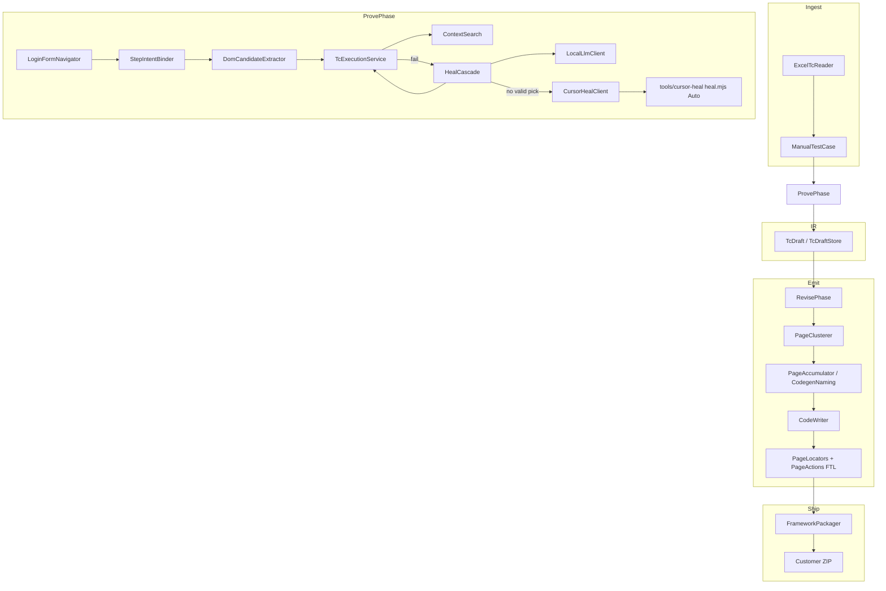

# Architecture audit — flow, defects, enhancements

**Date:** 2026-08-09  
**Graphify:** `graphify update . --force` → 1703 nodes / 4079 edges / 97 communities (`graphify-out/`).  
**Diagnose:** no collapsed same-endpoint edges; graph healthy for navigation.

## Flow to lowest nodes (runtime)



| Layer | Lowest useful nodes |
|-------|---------------------|
| Bind | `IntentLine`, `DomCandidate`, `BindResult` |
| Execute | `SelectorParser`, `actionExecute`, `ContextSearch.Hit` |
| Heal | `HealResult`, shortlist table, `candidateId` |
| IR | `ProvenStep`, `TcDraftStatus` |
| Codegen | `FieldModel`, `MethodModel`, `AssertionModel`, Freemarker model map |

---

## Defects (prioritized todos)

### P0 — fix before treating ZIPs as production-ready

| ID | Defect | Where |
|----|--------|--------|
| D1 | **Secrets leak into IR/codegen** — `resolveLoginSecrets` replaces `${TARGET_*}` with plaintext; emit may hardcode credentials instead of `PropertyReader` | `ProvePhase`, `CodeWriter.propKeyFor` |
| D2 | **Prove vs emit `textContains` mismatch** — prove often uses `body.getText()`; emit uses `getText(locator)` → customer suite can fail after green prove | `TcExecutionService`, `PageActions.java.ftl` |
| D3 | **Heal: bind-heal then execute-fail skips Cursor** — `healedThisAttempt` blocks escalate | `ProvePhase.attemptIntentWithRetry`, `HealCascade` |
| D4 | **Unchecked assert types soft-pass in POM** — `checked` / `notVisible` / etc. only log in template | `PageActions.java.ftl` |

### P1 — honesty / ops / security

| ID | Defect | Where |
|----|--------|--------|
| D5 | SemanticPassGate too thin (ignores intent count, expectedResult) | `SemanticPassGate` |
| D6 | RevisePhase REVIEW comments only — does not demote PASS | `RevisePhase` |
| D7 | Unknown `assertionType` → prove hard-pass (`default -> null`) | `TcExecutionService.runAssertion` |
| D8 | Cursor sidecar cwd not forced to repo root | `CursorHealClient` |
| D9 | Sidecar stderr merged into stdout JSON parse | `CursorHealClient` |
| D10 | Cursor heal gets screenshot **path string**, not image bytes | `heal.mjs` |
| D11 | CSRF disabled on `/api/**` | `SecurityConfig` |
| D12 | Job credentials not durable across portal restart | `JobEntity` / `PortalStore` |

### P2 — clustering / coverage

| ID | Defect | Where |
|----|--------|--------|
| D13 | `reclusterDraft` can remap leftover Login/Page login steps using **final** URL | `PageClusterer` |
| D14 | Batch prove path bypasses HealCascade | `ProvePhase.proveBatchFallback` |
| D15 | Binder marks xpath text asserts validated without `LocatorValidator` | `StepIntentBinder` |

**Graphify cannot see:** heal timing, CWD failures, body-vs-locator assert divergence, softAssert timing, credential loss after restart, live SPA races.

---

## Required enhancement backlog (ship order)

1. Secret hygiene: execute with secrets; persist/emit only `${TARGET_*}`  
2. Unify `textContains` prove ↔ emit  
3. Escalate Cursor after Ollama pick fails execute  
4. Full assert codegen parity with prove  
5. Honesty gate v2 + Revise demotion  
6. Harden Cursor sidecar (cwd, stderr, optional vision)  
7. Portal: CSRF strategy + encrypted/durable job secrets  
8. Customer ZIP compile+smoke gate before COMPLETED  
9. Persist login-form URL stem on IR for reclustering  
10. Per-step heal tier in AUTOMATION_SCORE / IR  

---

## Brainstorm — high-value product ideas

### Differentiation (why customers pay)

1. **Honesty Score dashboard** — % of Excel intents proven, heal tier mix, demoted PASSes; downloadable gate report next to ZIP.  
2. **Self-healing locator map store** — cross-job locator memory per project host; UPDATE mode reuses proven `candidateId`s before Ollama.  
3. **Visual diff on assert fail** — attach before/after PNG + DOM shortlist to portal job UI (already capture evidence; surface it).  
4. **Excel ↔ code traceability** — each Actions method annotated with Excel line / TC_ID; portal deep-link from score → step.  
5. **Multi-env packs** — same IR, emit `webapp.properties` profiles (SIT/UAT) with key naming `wallet_Number_SIT` style.

### Reliability

6. **Customer suite CI in worker** — `mvn -q test` (or compile) on generated project with dummy TARGET_*; fail job if emit broken.  
7. **Deterministic heal fixtures** — golden shortlist → expected `candidateId` tests for Ollama mock + Cursor mock (expand HealCascadeTest).  
8. **iframe/shadow budget** — metrics for ContextSearch hits; warn when >N steps needed context retry.  
9. **Flake quarantine** — if prove passes only after heal, mark step `HEALED` in IR and score (transparency).

### Cursor / AI leverage (cost-aware)

10. **Cursor only on AMBIGUOUS** after Ollama empty — already intended; add portal toggle “Cursor spend cap / day”.  
11. **Batch Cursor** — one Agent.prompt for N failed steps in a TC (fewer process spawns).  
12. **Human-in-the-loop pick** — portal UI shows shortlist + screenshot; PO clicks `c3` when AI exhausted.

### Platform

13. **Project memory** — store base URL, login policy, preferred locator strategies per project.  
14. **Webhook / Slack** on COMPLETED with score summary (reuse invite mail SMTP path).  
15. **OpenAPI for Job API** — enable external orchestrators.  
16. **Playwright emit track** (optional) — same IR, second CodeWriter backend for customers on PW.

### Domain quality

17. **Page object review mode** — emit Locators/Actions only (no tests) for PO/dev review.  
18. **Rename refactor assist** — if Excel renames control text, map old `_Locator` → new via locator-map.json.  
19. **A11y intents** — Excel “Confirm button is accessible name X” → role/name candidates in DomCandidateExtractor.

### Suggested next 3 (highest ROI)

1. **D1 + D2** (secrets + textContains parity) — trust + green customer runs  
2. **D3 + heal observability** — make Cursor actually fire when Ollama “succeeds” but execute fails  
3. **Customer ZIP compile smoke** — catch template/method mismatches before download  

---

## Graphify ops

```bat
graphify update .
graphify path "ProvePhase" "CodeWriter"
graphify explain "HealCascade"
graphify diagnose multigraph
```

Ignore rules: [`.graphifyignore`](../../.graphifyignore) (skips `delivery-work/`, template, stores).
