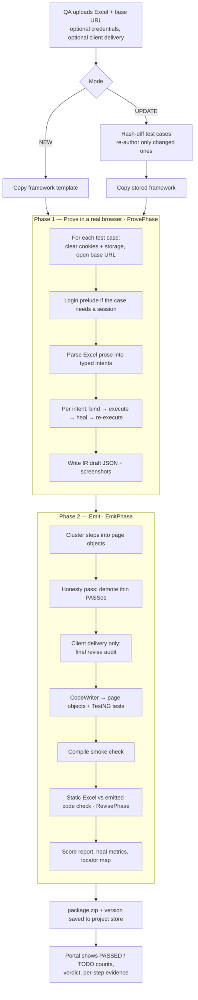
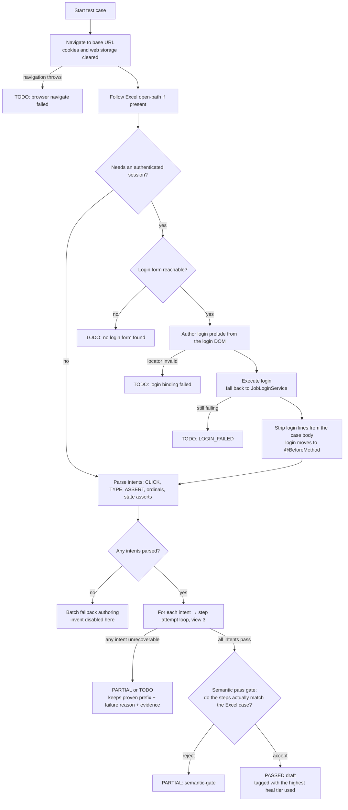
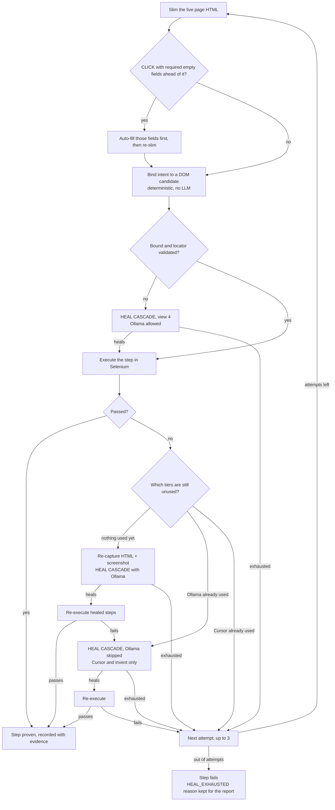
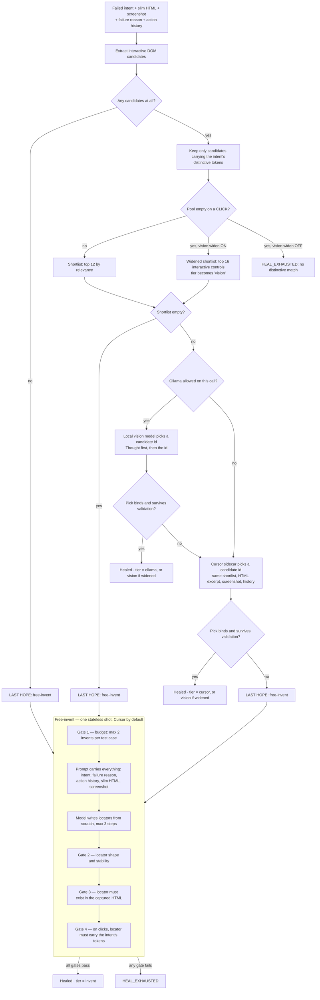

# TestPilot end-to-end flow

Four views, from widest to narrowest. Every box maps to real code, cited beside it.
Rendered PNGs of all four sit in `docs/ops/diagrams/` for pasting into slides or chat.

## 1. Whole job

Phase numbering in the code is historical: `RevisePhase` (static check) runs *inside* Phase 2, after codegen.

## 2. One test case in Phase 1

## 3. One step: bind, execute, heal, re-execute

This is `attemptIntentWithRetry`. The outer loop runs up to 3 times; within a single attempt, Ollama may fire once and Cursor once — that cap is what stops heal loops from running forever.

Every heal call carries the **action history** — a summary of the steps already proven in this case — so the model knows what the page has been through.

## 4. Inside the heal cascade

`HealCascade.heal`. Each tier is cheaper and safer than the one below it, and the result is always re-executed for real before it counts.

Validation gates 3 and 4 exist because an invented locator has no DOM candidate behind it. Without them a model can return a confident, well-formed locator for a control that is not on the page, or for the wrong control — and a wrong-but-clickable element would execute cleanly and be recorded as PASSED.

## Heal tiers

Tier is recorded per step, and a test case is tagged with the riskiest tier any of its steps needed.

| Tier | What resolved the step | Risk |
| --- | --- | --- |
| `none` | Deterministic DOM binding | Lowest |
| `ollama` | Local model picked from a distinctive shortlist | Low |
| `cursor` | Cursor sidecar picked from a distinctive shortlist | Medium |
| `vision` | Pick came from a widened pool — no distinctive tokens matched | High |
| `invent` | Locator written from scratch, no candidate behind it | Highest |

Ranking matters in two places: merging tiers across a case, and ordering which cases the final revise audit reviews first.

## Client delivery — final revise

Off by default. When enabled, after page clustering and before codegen:

1. **Honesty pass** demotes drafts that pass too thinly to be trustworthy.
2. **AgentRouter audit** re-reads each case against its Excel source, riskiest tiers first. It may demote a case or soft-block the job; it never invents locators or edits generated code.
3. Verdict lands in the portal as `SHIP`, `SHIP_WITH_REVIEW`, or `BLOCK`. `BLOCK` shows as `COMPLETED_WITH_BLOCK` — the ZIP is still produced and downloadable.

AgentRouter is not part of heal. The only exception is opt-in: `delivery.heal.invent.provider=agentrouter` swaps the invent provider away from Cursor.

## Configuration flags

| Property | Default | Effect |
| --- | --- | --- |
| `delivery.cursor-heal.enabled` | `true` | Cursor sidecar tier |
| `delivery.heal.vision-widen.enabled` | `true` | Widen instead of giving up when no distinctive tokens match |
| `delivery.heal.invent.enabled` | `true` | Last-hope invent |
| `delivery.heal.invent.provider` | `cursor` | `cursor` or `agentrouter` |
| `delivery.heal.invent.max-per-tc` | `2` | Invent budget per test case |
| `delivery.heal.invent.agentrouter.model` | unset | Cheap model for invent; warns and falls back to the audit model |
| `delivery.honesty-demote` | `false` | Demote thin PASSes outside client delivery |
